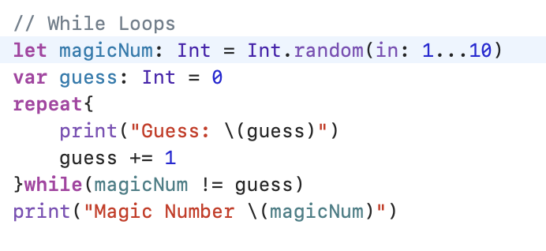

# Basic Notes:

#### Basics

#### Math

#### Trig Math Funcs

#### Conditionals

#### Terenaries

#### For Loops

#### While Loops:

#### repeat while:

#### Switch

Itorator Method Loops

#### Functions:

#### Funcs More Vals

#### recursion

#### Assign Func to Func

#### Funcs Making Funcs

